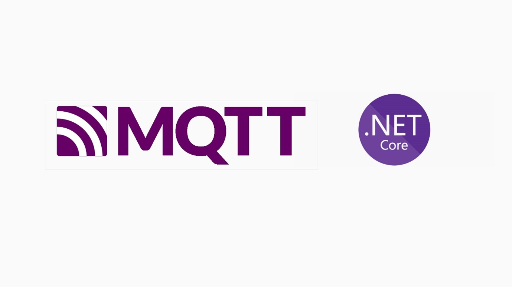

## MQTT .NET CORE Tutorial - ESP32 Firmware 

Projeto do firwmare para conexão do ESP32 ao broker MQTT Criado neste [repositório](https://github.com/Yago-Caetano/MQTT_NET_BACKEND)

### Execução

Utilize o PlatformIO para execução do projeto.
